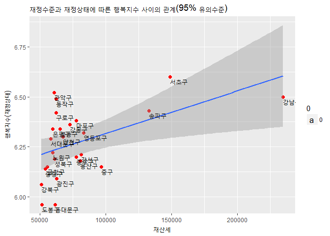
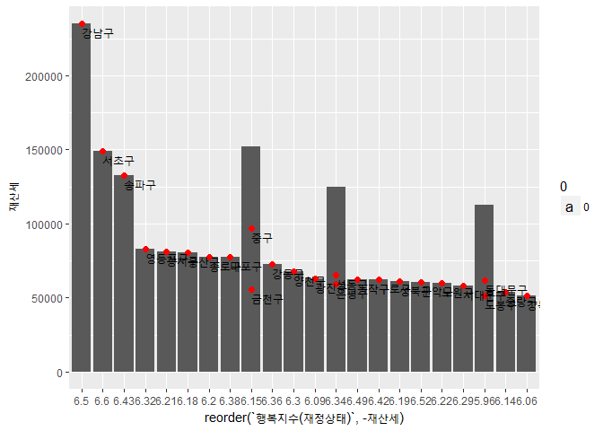

#### 초록

이 연구의 목적은 '재정수준과 재정상태에 따른 행복지수라는 두가지 변수에
따라 부와 행복 간의 상관관계가 어떻게 나타나는가'에 대한 답을 찾는데
있다. 연구에 사용된 자료는 서울시통계데이터에 공개된 행복지수(재정상태)
데이터와 지방세징수(재산세) 데이터를 사용했다. 이러한 데이터들을
바탕으로, 2016년을 기준 횡단면 분석 및 시계열 분석을 시행하였다.
분석에서는 재정수준이 높을 수록 재정상태에 따른 행복지수도 높을 것이다.
재정수준이 높은 사람들이 사는 지역과 재정상태에 대한 행복지수가 높은
사람이 사는 지역은 비슷할 것이다.라는 두 가지 가설을 세워 상관분석을
통해 가설을 검증하였으며 검증된 결론들과 함께 분석과정에서 나타난
한계점과 비판점을 찾아 다음 연구에 보완할 점들을 논할 것이다

#### 1. 분석(연구)의 필요성

돈과 행복은 비례할까. 여기에 관해서 1)돈은 행복의 증진과 비례한다,
2)돈은 행복의 증진과 비례하지만 어느 이상의 소득수준에서는 별상관이
없다. 3)돈과 행복사이에는 관련이 없다 등 여러 이론이 있지만 아직 어떠한
이론이 맞다는 사실은 입증되지 않았다. 사회 통념적으로 돈이 많으면 행복할
것이다라는 생각이 강하게 자리잡고 있지만 과연 이는 사회통념일 뿐일까.
이를 알아보기 위해 그와 관련된 가설을 세우고 객관적인 수치를 통해
검증해보려고 한다.그렇게 정해진 가설은 다음과 같다.

**(가설1)재정수준이 높을 수록 재정상태에 따른 행복지수도 높을
것이다.**  
**(가설2)재정수준이 높은 사람들이 사는 지역과 재정상태에 대한 행복지수가
높은 사람이 사는 지역은 비슷할 것이다.**  
가설2는 가설1에서 더 나아가 재정수준과 그에 따른 행복지수, 그리고 지역의
상관관계를 알아보려고 한다.

#### 2. 데이터 선정

분석에 필요한 데이터로 구별 지방 재정의 계획수립 및 운용 현황을 파악하기
위해 작성된 서울 특별시 세무과의 자료인 **2016 지방세 징수 데이터**와
서울시민의 주관적인 행복정도를 알기 위해 작성된 서울특별시
통계데이터담당관「서울서베이(도시정책지표조사)」에 의해 작성된 **2016
행복지수 데이터**를 사용하였다.

재산세 중 구세를 뽑아 분석에 사용한 이유는 구별로 분석을 시행하기 때문에
시세보다 좀 더 정확한 세금추이를 파악할 수 있기때문이다. 재정수준은
서울시 각 자치구의 지방세 세목별·세입 단위별(시세·구세) 징수들이 있는
데이터에서 재산세 데이터를 사용했다. 행복지수에 관한 데이터의 경우,
자신의 주관적인 행복점수를 0부터 10까지 표시한 문항으로 측정하였다.

#### 3. 데이터 분석

##### 3-1.필요한 패키지 불러오기

    library(ggplot2)  #필요한 패키지 장착
    library(dplyr) 

    ## 
    ## Attaching package: 'dplyr'

    ## The following objects are masked from 'package:stats':
    ## 
    ##     filter, lag

    ## The following objects are masked from 'package:base':
    ## 
    ##     intersect, setdiff, setequal, union

    library(readxl)

    load("df_total.rda") #필요한 rda 파일 가져오기

##### 3-2.데이터 전처리하기

    tax <- read_excel("2016지방세징수.xls")                #분석에 필요한 데이터(재산세) 빠져있어 데이터 합치기
    tax<-tax %>% filter(`기간` != '기간' & `자치구별` != '서울시' & `자치구별` != '본청') %>% select(`보통세__11`)
    df_total <- cbind(df_total, tax)                      #데이터와 데이터 cbind함수로 합치기
    df_total<-rename(df_total, `재산세`=`보통세__11`)      #변수명 바꾸기

    str(df_total)      #24열부터 32열까지 수치형이 아닌 문자형으로 인식 

    ## 'data.frame':    25 obs. of  32 variables:
    ##  $ 기간              : chr  "2016" "2016" "2016" "2016" ...
    ##  $ 구분              : chr  "종로구" "중구" "용산구" "성동구" ...
    ##  $ 계                : num  157423 131145 234241 289789 357921 ...
    ##  $ 0~4세             : num  4995 4909 9469 12672 14074 ...
    ##  $ 5~9세             : num  4903 4017 8411 10548 12294 ...
    ##  $ 10~14세           : num  5539 3587 8221 9979 12889 ...
    ##  $ 15~19세           : num  7883 5160 10701 13447 18840 ...
    ##  $ 20~24세           : num  11580 8553 14650 20400 26883 ...
    ##  $ 25~29세           : num  14051 10936 18988 24985 35304 ...
    ##  $ 30~34세           : num  12263 11058 21088 26001 33756 ...
    ##  $ 35~39세           : num  11262 10274 19865 24710 29012 ...
    ##  $ 40~44세           : num  12180 9974 19557 23190 27862 ...
    ##  $ 45~49세           : num  13169 10884 19109 23278 29158 ...
    ##  $ 50~54세           : num  13062 11303 18623 23563 29279 ...
    ##  $ 55~59세           : num  12664 11664 18134 22962 27912 ...
    ##  $ 60~64세           : num  10007 8941 13878 17197 20535 ...
    ##  $ 65~69세           : num  7598 6754 10742 13055 14779 ...
    ##  $ 70~74세           : num  6280 5348 8897 10072 10821 ...
    ##  $ 75~79세           : num  5059 3853 7039 7373 7603 ...
    ##  $ 80~84세           : num  2924 2383 4159 3958 4176 ...
    ##  $ 85~89세           : num  1379 1067 1846 1699 1880 ...
    ##  $ 90~94세           : num  482 384 709 555 676 ...
    ##  $ 95세 이상+        : num  143 96 155 145 188 194 218 262 192 201 ...
    ##  $ 취득세            : chr  "137454" "243277" "213768" "149712" ...
    ##  $ 종합 행복지수     : chr  "6.88" "6.75" "6.69" "6.9" ...
    ##  $ 행복지수(건강상태): chr  "7.11" "6.95" "6.88" "7.02" ...
    ##  $ 행복지수(재정상태): chr  "6.2" "6.15" "6.18" "6.34" ...
    ##  $ 행복지수(관계상태): chr  "7.01" "6.86" "6.75" "6.98" ...
    ##  $ 행복지수(가정생활): chr  "7.16" "6.99" "6.83" "7.15" ...
    ##  $ 행복지수(사회생활): chr  "6.93" "6.79" "6.8" "7.03" ...
    ##  $ 전체평균연령      : num  43.4 43.8 42.7 41.3 40.5 42.3 42.2 41.5 43.5 42.4 ...
    ##  $ 재산세            : chr  "77699" "96793" "80559" "65107" ...

    df_total[, 24:32] <- sapply(df_total[, 24:32], function(`행복지수(재정상태)`){as.numeric(as.character(`행복지수(재정상태)`))})    #24열 부터 32열 까지 수치형을 문자형으로 변화
    summary(df_total)

    ##      기간               구분                 계             0~4세      
    ##  Length:25          Length:25          Min.   :131145   Min.   : 4909  
    ##  Class :character   Class :character   1st Qu.:323167   1st Qu.:12672  
    ##  Mode  :character   Mode  :character   Median :396387   Median :16577  
    ##                                        Mean   :393388   Mean   :16291  
    ##                                        3rd Qu.:487455   3rd Qu.:20599  
    ##                                        Max.   :641527   Max.   :28162  
    ##      5~9세          10~14세         15~19세         20~24세     
    ##  Min.   : 4017   Min.   : 3587   Min.   : 5160   Min.   : 8553  
    ##  1st Qu.:11141   1st Qu.:11414   1st Qu.:15879   1st Qu.:23170  
    ##  Median :14026   Median :13588   Median :19251   Median :26883  
    ##  Mean   :14902   Mean   :15429   Mean   :20949   Mean   :27172  
    ##  3rd Qu.:19921   3rd Qu.:20115   3rd Qu.:26467   3rd Qu.:33416  
    ##  Max.   :26918   Max.   :28578   Max.   :38093   Max.   :44311  
    ##     25~29세         30~34세         35~39세         40~44세     
    ##  Min.   :10936   Min.   :11058   Min.   :10274   Min.   : 9974  
    ##  1st Qu.:24985   1st Qu.:25566   1st Qu.:24710   1st Qu.:25473  
    ##  Median :33301   Median :36525   Median :33150   Median :30816  
    ##  Mean   :32473   Mean   :34296   Mean   :31954   Mean   :31515  
    ##  3rd Qu.:38055   3rd Qu.:40826   3rd Qu.:39665   3rd Qu.:40002  
    ##  Max.   :59214   Max.   :56770   Max.   :53514   Max.   :52595  
    ##     45~49세         50~54세         55~59세         60~64세     
    ##  Min.   :10884   Min.   :11303   Min.   :11664   Min.   : 8941  
    ##  1st Qu.:25891   1st Qu.:25872   1st Qu.:26170   1st Qu.:20279  
    ##  Median :31730   Median :32966   Median :31925   Median :25174  
    ##  Mean   :32132   Mean   :31524   Mean   :31286   Mean   :24073  
    ##  3rd Qu.:39368   3rd Qu.:38161   3rd Qu.:37140   3rd Qu.:29373  
    ##  Max.   :53000   Max.   :51133   Max.   :50759   Max.   :38654  
    ##     65~69세         70~74세         75~79세         80~84세    
    ##  Min.   : 6754   Min.   : 5348   Min.   : 3853   Min.   :2383  
    ##  1st Qu.:14779   1st Qu.:12199   1st Qu.: 8538   1st Qu.:5105  
    ##  Median :18580   Median :13874   Median : 9586   Median :5391  
    ##  Mean   :17791   Mean   :13246   Mean   : 9442   Mean   :5338  
    ##  3rd Qu.:21205   3rd Qu.:14667   3rd Qu.:10003   3rd Qu.:5852  
    ##  Max.   :25999   Max.   :18813   Max.   :13772   Max.   :7897  
    ##     85~89세        90~94세         95세 이상+        취득세      
    ##  Min.   :1067   Min.   : 384.0   Min.   : 96.0   Min.   : 62028  
    ##  1st Qu.:2119   1st Qu.: 752.0   1st Qu.:176.0   1st Qu.:111767  
    ##  Median :2405   Median : 826.0   Median :210.0   Median :137454  
    ##  Mean   :2484   Mean   : 877.6   Mean   :213.8   Mean   :195691  
    ##  3rd Qu.:2978   3rd Qu.:1111.0   3rd Qu.:262.0   3rd Qu.:224110  
    ##  Max.   :3932   Max.   :1360.0   Max.   :343.0   Max.   :712797  
    ##  종합 행복지수   행복지수(건강상태) 행복지수(재정상태) 행복지수(관계상태)
    ##  Min.   :6.660   Min.   :6.86       Min.   :5.960      Min.   :6.750     
    ##  1st Qu.:6.840   1st Qu.:7.02       1st Qu.:6.150      1st Qu.:6.960     
    ##  Median :6.950   Median :7.13       Median :6.290      Median :7.070     
    ##  Mean   :6.941   Mean   :7.17       Mean   :6.272      Mean   :7.084     
    ##  3rd Qu.:7.010   3rd Qu.:7.29       3rd Qu.:6.380      3rd Qu.:7.170     
    ##  Max.   :7.300   Max.   :7.66       Max.   :6.600      Max.   :7.470     
    ##  행복지수(가정생활) 행복지수(사회생활)  전체평균연령       재산세      
    ##  Min.   :6.830      Min.   :6.790      Min.   :39.50   Min.   : 51218  
    ##  1st Qu.:7.030      1st Qu.:6.930      1st Qu.:40.50   1st Qu.: 59684  
    ##  Median :7.180      Median :7.030      Median :41.30   Median : 62759  
    ##  Mean   :7.156      Mean   :7.026      Mean   :41.45   Mean   : 79188  
    ##  3rd Qu.:7.240      3rd Qu.:7.080      3rd Qu.:42.30   3rd Qu.: 80559  
    ##  Max.   :7.530      Max.   :7.350      Max.   :43.80   Max.   :234911

##### 3-3.필요한 데이터 선택

    happiness1<- df_total %>% select(`구분`, `행복지수(재정상태)`, `재산세`)  
    happiness1

    ##        구분 행복지수(재정상태) 재산세
    ## 1    종로구               6.20  77699
    ## 2      중구               6.15  96793
    ## 3    용산구               6.18  80559
    ## 4    성동구               6.34  65107
    ## 5    광진구               6.09  62759
    ## 6  동대문구               5.96  61529
    ## 7    중랑구               6.14  54076
    ## 8    성북구               6.19  61155
    ## 9    강북구               6.06  51218
    ## 10   도봉구               5.96  51400
    ## 11   노원구               6.22  59684
    ## 12   은평구               6.34  59595
    ## 13 서대문구               6.29  58017
    ## 14   마포구               6.38  77532
    ## 15   양천구               6.30  67656
    ## 16   강서구               6.21  81206
    ## 17   구로구               6.42  62316
    ## 18   금천구               6.15  55469
    ## 19 영등포구               6.32  83051
    ## 20   동작구               6.49  62347
    ## 21   관악구               6.52  60782
    ## 22   서초구               6.60 148983
    ## 23   강남구               6.50 234911
    ## 24   송파구               6.43 132927
    ## 25   강동구               6.36  72924

##### 3-4. 그래프 분석

    cor.test(happiness1$`재산세`,happiness1$`행복지수(재정상태)`)   #재산세와 재정상태에 따른 행복지수의 상관관계 분석

    ## 
    ##  Pearson's product-moment correlation
    ## 
    ## data:  happiness1$재산세 and happiness1$`행복지수(재정상태)`
    ## t = 2.7862, df = 23, p-value = 0.0105
    ## alternative hypothesis: true correlation is not equal to 0
    ## 95 percent confidence interval:
    ##  0.1337673 0.7488384
    ## sample estimates:
    ##       cor 
    ## 0.5023463

사람들의 소득지수를 알아보기 위해 `재산세`를 가지고 분석을 해보았다.
재산세를 가지고 소득수준을 알아보았을 때는 p-value = 0.0105로 0.05보다
작기 때문에 유의미하게 나와 가설을 검증할 수 있었다. 그래프는 상관계수가
0.5923463으로 양의 값이 나와 양의 상관관계임을 알 수 있으며 따라서
대체로 재정수준이 높을 수록 재정상태에 따른 행복지수도 높다는 가설이
검증되었다.

    library(plotly)  #그래프에 자세한 정보 나타내기 위한 패키지 불러오기

    ## 
    ## Attaching package: 'plotly'

    ## The following object is masked from 'package:ggplot2':
    ## 
    ##     last_plot

    ## The following object is masked from 'package:stats':
    ## 
    ##     filter

    ## The following object is masked from 'package:graphics':
    ## 
    ##     layout

    ggplot(data=happiness1, aes(x=`재산세`, y=`행복지수(재정상태)`))+
      geom_point(shape=19, size = 2, colour = "red")+
      ggtitle("재정수준과 재정상태에 따른 행복지수 사이의 관계(95% 유의수준)")+
      stat_smooth(method=lm, level=0.95)+ 
      geom_text(aes(label = `구분`, size = 0, vjust = 1, hjust = 0))

그래프를 보면 강남구, 송파구, 서초구가 재정수준과, 재정상태에 대한
행복지수가 월등히 높은 것을 볼 수 있다. 따라서 대체적으로 재정수준이
높을 수록 그에 따른 행복지수도 높다는 사실이 드러났다. 그러나 관악구와
동작구의 경우에는 다른 자치구들에 비해 재정수준과 재정상태에 따른
행복지수가 별 상관이 없는 것으로 나타났다.

    ggplot(data=happiness1, aes(x=reorder(`행복지수(재정상태)`, -`재산세`), y=`재산세`))+ geom_col()+
      geom_point(shape=19, size = 2, colour = "red")+
      geom_text(aes(label = `구분`, size = 0, vjust = 1, hjust = 0))

재산세와 재정상태에 따른 행복지수가 높은 지역을 표로 나타내었더니 둘 다
강남구, 서초구, 송파구 순으로 월등히 높게 나타난다. 재산세가 가장적은
강북구와 재산세가 가장 많은 강남구의 경우에는 4배 이상 재산세의 차이가
나며 이 그래프에서도 재산수준이 높을 수록 재정상태에 따른 행복지수도
높은 것을 볼 수 있다.

#### 4.결론

(가설1)재정수준이 높을 수록 재정상태에 따른 행복지수도 높을 것이다-&gt;
0.0105 p-value 값으로 유의미하며 정비례를 그리는 그래프로 **가설
채택**  
(가설2)재정수준이 높은 사람들이 사는 지역과 재정상태에 대한 행복지수가
높은 사람이 사는 지역은 비슷할 것이다.-&gt; 강남구, 서초구, 송파구 세
지역이 재산세와 재정상태에 따른 행복지수가 모두 높은 것으로 보아 **가설
채택**

재정수준이 높을수록 재정상태에 따른 행복지수가 높다는 가설을
검증하였으며 서울시 안에 서는 강남구, 서초구, 송파구가 재정수준이 높으며
재정상태에 따른 행복지수 또한 비슷하게 나타났다. 따라서 재정수준이 높은
사람들이 사는 지역과 재정상태에 대한 행복지수가 높은 사람이 사는 지역이
비슷하다고 보여진다.

#### 5.논의

##### 한계점

1.  관악구와 동작구의 경우 다른 서울시 자치구들과 특히 다른 양상을
    보이고 있다. 재정수준에 비해 행복지수가 높은데 이를 설명하기는
    어려운 점이 있다.
2.  재정상태에 따른 행복지수가 6점 수준에서 머물러 있어 자치구별로 큰
    차이가 있지 않다.
3.  세금(재산세)으로 자치구별 재정상태를 분석했기 때문에 탈세의 가능성이
    있을 수 있다. 그래서 재산세와 재정수준을 동일시 하는 것은 한계가
    있다.  
4.  시간이 지남에 따라 달라지는 시계열자료가 아닌 단적인 자료를 사용하여
    2016년 서울시로 한정지었기 때문에 일반화하기 어렵다.
5.  자치구별 개인별소득이 아닌 각 구별 재산세를 변수로 사용했기 때문에
    결과가 정확하지 않을 수 있다.  
    (예를들어 강남구에 못사는 사람도 많지만 잘사는 몇몇의 재산세가
    월등히 높아 구별 재산세가 높을 수 있다.)

##### 추후분석방향

1.  각 자치구별로 1인당 평균 소득 자료를 구해 소득과 행복지수와의
    상관관계를 분석하는 등 다양한 자료들을 분석하여 새로운 결론을 도출해
    내면 좋을 것이다.
2.  관악구와 동작구와 같이 특이하게 나온 지역들이 왜 그렇게 나왔는지
    설명할 수있는 분석을 하면 좋을 것이다.
3.  2016년도 뿐만 아니라 과거의 데이터를 수집하여 시계열자료로 분석을
    한다면 서울시 내의 재정수준에 따른 행복지수 변화 추이 또한 알 수
    있을 것이다.
